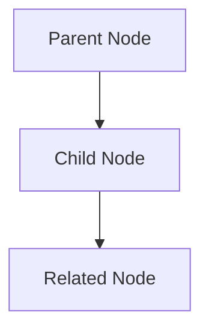

# Graph Viz Mermaid

## When to Use
- "Mostra grafo", "visualizza aleph", "disegna mappa"
- Knowledge graph visualization

## Protocol

### 1. Generate Mermaid Graph

### 2. Color Coding
- 🔵 **Blue nodes**: Raw data (from Scraper)
- 🟢 **Green nodes**: Synthesized knowledge (Aleph Core)
- 🟡 **Yellow nodes**: Pending validation
- 🔴 **Red nodes**: Conflicting/outdated info

### 3. Relationship Labels
Label all edges with descriptive relationships:
- `-->|extends|`
- `-->|contradicts|`
- `-->|references|`
- `-->|depends_on|`

### 4. Output
Complete Mermaid.js code ready for rendering.
Include a legend explaining color scheme.
